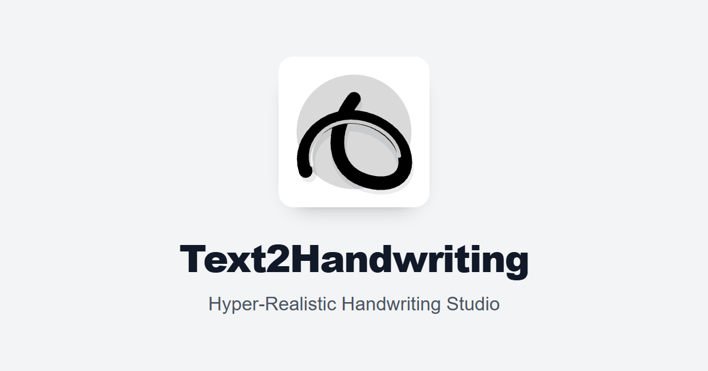

<div align="center">

# 🖋️ InkTrail



### Next-Gen Hyper-Realistic Text-to-Handwriting Studio with 3D Camera Physics, Smart Margin Indexing, and Organic Human Flaws

[](https://inktrail-omega.vercel.app)
[](https://github.com/bipin-vishwakarma/papertrail)
[](LICENSE)

[](https://react.dev)
[](https://vitejs.dev)
[](https://www.typescriptlang.org)
[](https://tailwindcss.com)

**[Key Features](#-key-features)** • **[Smart Margin Engine](#-1-smart-margin-indexing-engine)** • **[Camera & Physics](#-3-3d-camera-physics--photo-effects)** • **[Quick Start](#-quick-start)** • **[Deployment](#-deployment-to-vercel)**

</div>

---

## 🌟 What is InkTrail?

**InkTrail** is a privacy-first, zero-friction web application designed to turn standard typed text, assignments, and study notes into **indistinguishable physical handwriting photos**.

Unlike traditional handwriting generators that simply render flat web fonts in a digital grid, InkTrail reproduces the subtle physical flaws and optical imperfections of analog handwriting on paper:
- **Hand Dynamics**: Letter micro-jitter, pen pressure variance, baseline wobble, and progressive wrist fatigue.
- **Smart Academic Layout**: Automated detection of question numbers, answers, roman numerals, and bullets rendered in the paper's left margin.
- **Organic Corrections**: Procedural scratch-outs (wavy scribbles, dense blackouts, strikes) and caret (`^`) insertions.
- **Physical Environment**: 3D camera angles, smartphone cast shadows, warm desk lamp lighting, and realistic paper folds and creases.
- **Zero Friction**: 100% client-side rendering with zero mandatory logins or paywalls for PDF/PNG exports.

---

## ⚡ Key Features

### 📐 1. Smart Margin Indexing Engine
Simulates the authentic way students and researchers write notes and exams on ruled margin paper:
- **Autonomous Margin Detection**: Identifies prefixes such as:
  - **Questions & Answers**: `Q1.`, `Q.2`, `Ans:`, `Answer:`, `Solution:`, `Note:`
  - **Numeric & Alphabetic Subsections**: `1.`, `(a)`, `b)`, `IV.`, `(iii)`
  - **Academic Steps**: `Step 1:`, `Case A:`, `Ex. 3:`
  - **Bulleted Pointers**: `•`, `-`, `*`, `→`
- **Authentic Alignment**: Positioned dynamically to the left of the vertical red margin line, perfectly baseline-aligned with the accompanying handwriting.
- **Smart Toggle**: Can be enabled or disabled with a single click in the studio drawer.

---

### ✍️ 2. Direct On-Paper Studio Editing
- **Dual-Pane or Direct Interaction**: Edit text in the side drawer or double-click directly on the paper canvas to type on the sheet itself.
- **0ms Keystroke Latency**: Optimized tokenization and rendering pipeline ensures butter-smooth typing even with complex procedural effects active.
- **Interactive Formatting Controls**: Quick insertion of human mistakes, scratch-outs, carets, and section markers.

---

### 📐 3. 3D Camera Physics & Tilt Preservation
- **True 3D Spatial Angles**: Rotates notebook pages in 3D space (`perspective(1000px)`, `rotateX`, `rotateY`, and `scale`) mimicking high-angle smartphone camera snapshots.
- **Random Angle Generator**: One-click procedural angle generator that rolls authentic hand-held phone camera rotations ($0.5^\circ - 3.5^\circ$) with tilt jitter per page.
- **Export-Preserved Non-Planar Geometry**: Unlike standard canvas captures that flatten 3D matrices, InkTrail's export pipeline renders the exact 3D tilt, aspect ratio, and perspective into exported PDFs and Ultra-HD PNG/JPEGs.

---

### 📜 4. 9 Procedural Paper Creases & Folds
Real paper rarely stays completely flat. Choose from 9 authentic physical paper wear profiles:
1. **None**: Crisp, fresh printer paper.
2. **Horizontal Half Fold**: Center fold crease from folding an A4 sheet in half.
3. **Quarter Cross Fold**: 4-quadrant letter fold lines.
4. **Dog-Eared Corner**: Classic bent page corner.
5. **Diagonal Crease**: Hurried textbook bookmark angle fold.
6. **Subtle Wrinkle**: Soft, natural organic paper texture.
7. **Heavy Crease**: Distinct pressure fold lines.
8. **Crumpled & Flattened**: Deep textured distress pattern.
9. **Trifold Brochure**: Letter-style three-panel vertical folds.

---

### ✂️ 5. Procedural Pen Scratch & Correction Engine
- **4 Scratch-Out Styles**:
  - 〰️ **Wavy Scribble**: Natural, looping cursive blackout loops.
  - ⬛ **Dense Blackout**: Anxious, heavy zig-zag pen obliteration.
  - ➖ **Single Strike**: A quick, hurried slash.
  - ═ **Double Strike**: Deliberate double-line strike-through.
- **Handwritten Caret Insertion (`^`)**: Renders realistic caret marks with the corrected word handwritten directly above the line.
- **Markdown Syntax Support**:
  - `~~word~~` $\rightarrow$ Scratch out word.
  - `~~mistake~~^correction` $\rightarrow$ Scratch out mistake and write "correction" above with a caret.
- **Progressive Writer Fatigue**: Subtly increases baseline drift, slant, and letter spacing towards the bottom of long pages.

---

### 📸 6. Lighting & Smartphone Cast Shadow
- **Smartphone Silhouette Shadow**: Realistic soft-edged silhouette of a phone hovering over the notebook, with customizable angle ($0^\circ - 360^\circ$) and shadow density.
- **Room Lighting Environments**:
  - 🛋️ **Warm Desk Lamp**: Tungsten 2900K gradient with adjustable warmth slider.
  - ☀️ **Cool Daylight**: Natural window exposure lighting.
  - ⚡ **Camera Flash**: High-intensity central flash hotspot.
  - 📄 **Scanner Mode**: High-contrast, clean document scan.
- **Film Grain & Vignette**: Micro-noise texture to eliminate sterile digital vector edges.

---

### 🖋️ 7. Pen Presets & Realistic Papers
- **Pen Presets**:
  - 🖊️ **Blue Ballpoint** (`#1e40af`) — Classic student pen
  - 🖋️ **Black Gel Pen** (`#111827`) — Deep dark ink
  - ✒️ **Royal Blue Fountain** (`#1d4ed8`) — Parker royal blue
  - ✏️ **HB #2 Pencil** (`#4b5563`) — Graphite texture
  - 🔴 **Teacher Red Pen** (`#dc2626`) — Exam grading ink
- **Paper Styles**:
  - 📝 **College Ruled (Red Margin)** — Classic 65px vertical margin line
  - 📜 **Standard Blue Ruled** — Clean lined notebook paper
  - 📋 **Yellow Legal Pad** — Professional yellow pad with margin line
  - 📐 **Math / Engineering Grid** — Precision 24px grid paper
  - 📄 **Plain White A4** — Unlined printer paper

---

### 🗂️ 8. 15 Curated Authentic Handwriting Fonts
Loaded locally in `/public/fonts/`:
- `Handwriting 1` through `Handwriting 14` (Clean Pen, Casual Slant, Neat Ballpoint, Fluid Cursive, Fast Flow, Compact Print, Loose Homework, Fine Nib, Quick Notes, Forward Lean, Natural Cursive, Rounded Junior, Micro Gel, Expressive).
- `Hindi Handwriting` (Full Devnagari handwriting support).
- Google Fonts curated for messy, cute, casual, and formal handwriting styles.

---

### 🖨️ 9. Multi-Page Live Export Preview
- **Pre-Export Inspection**: Scroll through all generated pages with all active 3D tilts, shadows, and creases rendered before downloading.
- **Ultra-HD Resolution**: Renders pages at crisp print resolutions (up to $2480 \times 3508$ pixels for A4).
- **Multi-Format Export**:
  - Single/Multi-page PDF document.
  - High-resolution JPEG/PNG ZIP archive.
- **Zero Login Wall**: No email signup, no Google login required.

---

## 🚀 Quick Start

### 1. Clone the Repository
```bash
git clone https://github.com/bipin-vishwakarma/papertrail.git inktrail
cd inktrail
```

### 2. Install Dependencies
```bash
npm install
```

### 3. Run Development Server
```bash
npm run dev
```
Open [http://localhost:5173](http://localhost:5173) in your browser.

### 4. Build for Production
```bash
npm run build
```

---

## ☁️ Deployment to Vercel

InkTrail is pre-configured with SPA routing and client-side rewrites in `vercel.json`.

### Option A: Using Vercel CLI
```bash
npx vercel --prod
```

### Option B: Deploy via GitHub
1. Push this repository to GitHub.
2. Go to [Vercel Dashboard](https://vercel.com/new).
3. Import your repository and click **Deploy**.
   - **Framework Preset**: Vite
   - **Build Command**: `npm run build`
   - **Output Directory**: `dist`

---

## 🛠️ Tech Stack

| Technology | Purpose |
| :--- | :--- |
| **React 19** | Modern UI components & hooks |
| **Vite 7** | Next-generation frontend tooling & lightning-fast HMR |
| **TypeScript 5.9** | Strict type safety with `verbatimModuleSyntax` |
| **Tailwind CSS v4** | Modern utility-first styling with high-performance CSS |
| **Zustand** | Centralized reactive state management |
| **Framer Motion** | Fluid animations, drawers, and modal transitions |
| **modern-screenshot & jsPDF** | High-fidelity canvas capture and PDF generation |
| **JSZip** | Multi-image compression for batch export |
| **Lucide React** | Clean, accessible vector icons |

---

## 📁 Project Structure

```
inktrail/
├── public/
│   ├── fonts/           # 15+ locally loaded authentic handwriting fonts
│   ├── images/          # Assets, paper textures, and logos
│   └── templates/       # Pre-packaged assignment & exam paper presets
├── src/
│   ├── components/
│   │   ├── canvas/      # Direct on-paper canvas, margin engine & 3D tilt wrapper
│   │   ├── layout/      # Navbar, footer, and page layouts
│   │   ├── modals/      # Export preview modal, reset dialog, auth modal
│   │   ├── studio/      # Formatting drawer, effects drawer, paper controls
│   │   └── ui/          # Apple/Linear styled switches, sliders, buttons
│   ├── context/         # Auth & settings context
│   ├── lib/             # Zustand store & global state
│   ├── pages/           # Editor studio, landing page, and legal pages
│   └── utils/           # Human error engine, margin parser, camera physics
├── vercel.json          # SPA rewrite rules for zero-404 Vercel deployments
└── package.json
```

---

## 📄 License

This project is open source and available under the [MIT License](LICENSE).

---

<div align="center">
  Crafted with ❤️ by <a href="https://github.com/bipin-vishwakarma"><strong>Bipin Vishwakarma</strong></a>
</div>
